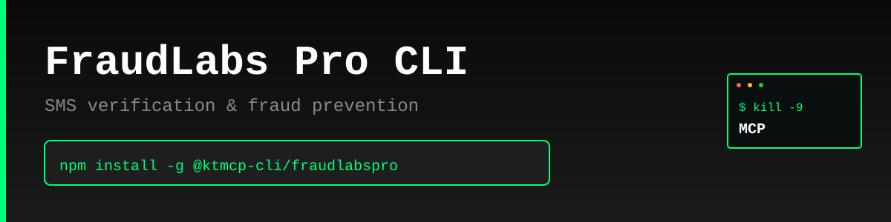

> "Six months ago, everyone was talking about MCPs. And I was like, screw MCPs. Every MCP would be better as a CLI."
>
> — [Peter Steinberger](https://twitter.com/steipete), Founder of OpenClaw
> [Watch on YouTube (~2:39:00)](https://www.youtube.com/@lexfridman) | [Lex Fridman Podcast #491](https://lexfridman.com/peter-steinberger/)

# FraudLabs Pro CLI

Production-ready command-line interface for FraudLabs Pro SMS Verification API - authenticate users with SMS verification codes and prevent fraud.

> **⚠️ Unofficial CLI** - This tool is not officially sponsored by FraudLabs Pro. Use at your own risk. Always test in development before production use.

## Features

- 📱 **SMS Verification** - Send OTP codes via SMS for authentication
- ✅ **OTP Verification** - Verify user-submitted codes
- 🛡️ **Fraud Prevention** - Leverage FraudLabs Pro's fraud detection
- 📊 **JSON Output** - Machine-readable output for automation
- 🔑 **Secure** - API key management with encrypted local storage
- ⚡ **Fast** - Lightweight, no bloat, just works

## Why CLI > MCP

- ✅ Works instantly - no server setup required
- ✅ Direct API access - no middleware overhead
- ✅ Composable with standard Unix tools (grep, jq, etc.)
- ✅ Perfect for automation and scripting
- ✅ Lower latency, simpler architecture

## Installation

```bash
npm install -g @ktmcp-cli/fraudlabspro
```

## Quick Start

```bash
# Configure your API key
fraudlabspro config set --api-key YOUR_API_KEY

# Send verification code
fraudlabspro send --tel +12025550123

# Verify OTP code
fraudlabspro verify --tran-id abc123 --otp 123456

# JSON output for scripting
fraudlabspro send --tel +12025550123 --json | jq '.tran_id'
```

## Commands

### Configuration

```bash
# Show current config
fraudlabspro config show

# Set API key
fraudlabspro config set --api-key YOUR_API_KEY

# Set custom API base URL (optional)
fraudlabspro config set --base-url https://api.fraudlabspro.com
```

### Send SMS Verification

Send an SMS with a verification code to a phone number.

```bash
# Send with default message
fraudlabspro send --tel +12025550123

# Send with country code validation
fraudlabspro send --tel +12025550123 --country-code US

# Send with custom message (use <otp> placeholder)
fraudlabspro send --tel +12025550123 --mesg "Your code is <otp>"

# Override API key for this request
fraudlabspro send --tel +12025550123 --key DIFFERENT_API_KEY

# JSON output
fraudlabspro send --tel +12025550123 --json
```

**Parameters:**
- `-t, --tel` (required): Mobile phone number in E164 format (e.g., +12025550123)
- `-c, --country-code`: ISO 3166 country code for validation (e.g., US, GB, CA)
- `-m, --mesg`: Custom SMS message with `<otp>` placeholder (max 140 chars)
- `-k, --key`: Override configured API key for this request
- `--json`: Output as JSON

### Verify OTP

Verify an OTP code submitted by the user.

```bash
# Verify OTP
fraudlabspro verify --tran-id abc123 --otp 123456

# Override API key for this request
fraudlabspro verify --tran-id abc123 --otp 123456 --key DIFFERENT_API_KEY

# JSON output
fraudlabspro verify --tran-id abc123 --otp 123456 --json
```

**Parameters:**
- `-i, --tran-id` (required): Transaction ID from send command
- `-o, --otp` (required): OTP code to verify
- `-k, --key`: Override configured API key for this request
- `--json`: Output as JSON

## JSON Output

All commands support `--json` flag for machine-readable output:

```bash
fraudlabspro send --tel +12025550123 --json
fraudlabspro verify --tran-id abc123 --otp 123456 --json
```

## Use Cases

- **User Authentication** - Verify phone numbers during signup/login
- **Two-Factor Authentication** - Add an extra security layer
- **Password Recovery** - Securely reset passwords via SMS
- **Transaction Verification** - Confirm high-value transactions
- **Fraud Prevention** - Detect and prevent fraudulent signups
- **Automation** - Integrate SMS verification into scripts and pipelines

## API Reference

FraudLabs Pro provides fraud detection and SMS verification services. API documentation:

- **API Docs**: https://www.fraudlabspro.com/developer/api/send-verification
- **Website**: https://www.fraudlabspro.com

## Phone Number Format

Phone numbers must be in E164 format:
- Start with `+` followed by country code
- No spaces, dashes, or parentheses
- Examples: `+12025550123` (US), `+447700900123` (UK), `+61412345678` (AU)

## Error Handling

The CLI provides clear error messages for common issues:
- Missing API key
- Invalid phone number format
- Insufficient credits
- Network errors

Exit codes:
- `0`: Success
- `1`: Error occurred

## License

MIT © KTMCP

---

**KTMCP** - Kill The MCP. Because CLIs are better.


---

## Support KTMCP

If you find this CLI useful, we'd greatly appreciate your support! Share your experience on:
- Reddit
- Twitter/X
- Hacker News

**Incentive:** Users who can demonstrate that their support/advocacy helped advance KTMCP will have their feature requests and issues prioritized.

Just be mindful - these are real accounts and real communities. Authentic mentions and genuine recommendations go a long way!

## Support This Project

If you find this CLI useful, we'd appreciate support across Reddit, Twitter, Hacker News, or Moltbook. Please be mindful - these are real community accounts. Contributors who can demonstrate their support helped advance KTMCP will have their PRs and feature requests prioritized.
